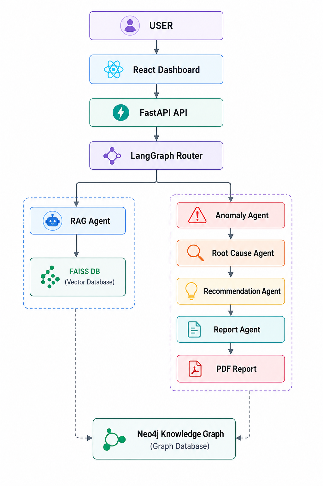

# 💊 Pharma Manufacturing Intelligence Platform

An AI-powered Pharma Manufacturing Intelligence Platform built using **LangGraph, FastAPI, React, Neo4j, and Retrieval-Augmented Generation (RAG)**.

The system simulates a real-world pharmaceutical manufacturing environment by combining multiple AI agents for anomaly detection, root cause analysis, recommendation generation, knowledge retrieval, and automated reporting.

---

## 🚀 Features

### Multi-Agent AI Workflow

* Router Agent
* RAG Agent
* Anomaly Detection Agent
* Root Cause Analysis Agent
* Recommendation Agent
* Report Generation Agent

### Manufacturing Intelligence

* Production Batch Analysis
* Manufacturing Anomaly Detection
* Root Cause Identification
* Corrective Action Recommendations
* Automated PDF Report Generation

### Knowledge Management

* FAISS Vector Database
* Retrieval-Augmented Generation (RAG)
* Neo4j Knowledge Graph
* Pharmaceutical SOP & GMP Knowledge Retrieval

### Interactive Dashboard

* React Frontend
* FastAPI Backend
* Real-Time Query Interface
* Performance Visualization
* Professional Manufacturing Dashboard

---

# 🏗 System Architecture



### Workflow

User Query

↓

React Dashboard

↓

FastAPI Backend

↓

LangGraph Router Agent

├── RAG Agent (Knowledge Retrieval)

├── Anomaly Agent

├── Root Cause Agent

├── Recommendation Agent

└── Report Agent

↓

Neo4j Knowledge Graph + FAISS Vector Database

↓

PDF Intelligence Report

---

# 🛠 Technology Stack

## Frontend

* React
* Vite
* JavaScript
* CSS

## Backend

* FastAPI
* LangGraph
* LangChain
* Python

## AI & Machine Learning

* Retrieval-Augmented Generation (RAG)
* Multi-Agent AI Systems
* Sentence Transformers
* FAISS Vector Database

## Database

* Neo4j Knowledge Graph
* FAISS Vector Store

## Reporting

* ReportLab
* PDF Generation

---

# 📂 Project Structure

```text
pharma-multi-agent-ai/

├── backend/
│   ├── agents/
│   ├── database/
│   ├── vector_db/
│   ├── reports/
│   ├── main.py
│   └── requirements.txt
│
├── frontend/
│   ├── src/
│   ├── public/
│   └── package.json
│
├── docs/
│   └── architecture.png
│
├── docker-compose.yml
├── README.md
└── .gitignore
```

# ⚙️ Installation

## Clone Repository

```bash
git clone https://github.com/umairahmad744/pharma-multi-agent-ai.git

cd pharma-multi-agent-ai
```

## Backend Setup

```bash
cd backend

pip install -r requirements.txt

uvicorn main:app --reload
```

Backend URL:

```text
http://127.0.0.1:8000
```

API Documentation:

```text
http://127.0.0.1:8000/docs
```

## Frontend Setup

```bash
cd frontend

npm install

npm run dev
```

Frontend URL:

```text
http://localhost:5173
```

---

# 📊 Example Queries

### Knowledge Retrieval

```text
What is GMP?
```

### Manufacturing Analysis

```text
Analyse today's production batches
```

### Root Cause Investigation

```text
Identify causes of abnormal batch performance
```

### Recommendations

```text
Suggest corrective actions for detected anomalies
```

---

# 📄 Generated Reports

The platform automatically generates PDF intelligence reports containing:

* Detected anomalies
* Root causes
* Recommendations
* Manufacturing insights
* Operational summaries

---

# 🔮 Future Enhancements

* JWT Authentication
* Role-Based Access Control
* Cloud Deployment
* Real-Time Manufacturing Monitoring
* Predictive Maintenance Models
* LLM-Based Manufacturing Assistant
* SAP / MES Integration
* Production KPI Dashboard

---

# 🎯 Project Objective

This project demonstrates how Multi-Agent AI Systems, Knowledge Graphs, and Retrieval-Augmented Generation can be combined to create intelligent decision-support systems for pharmaceutical manufacturing environments.

---

# 👨‍💻 Author

Umair Ahmad

GitHub:
https://github.com/umairahmad744

---

### If you found this project interesting, consider giving it a ⭐ on GitHub.
